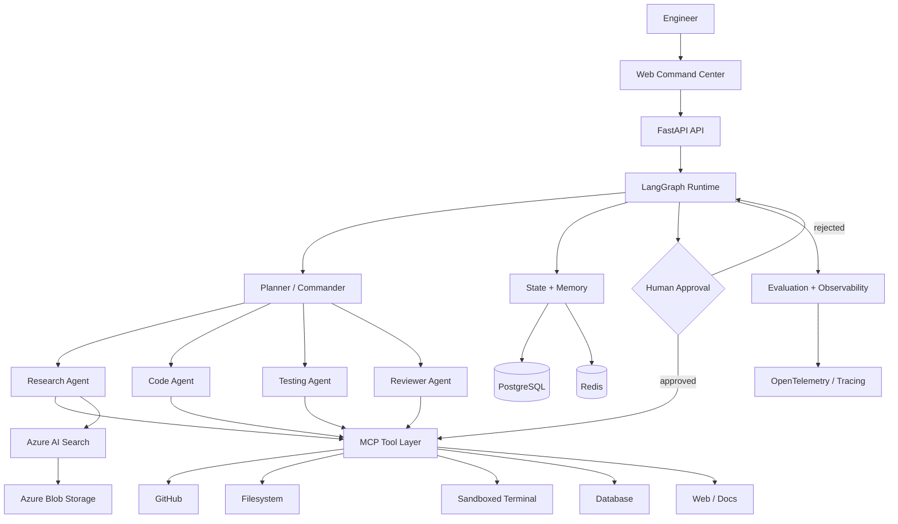

# AI Engineering Command Center

> An agentic AI platform that investigates real engineering problems, uses tools, proposes fixes, runs verification, and pauses for human approval before risky actions.

## Why this project exists

Most AI coding demos stop at code generation. The Command Center is designed around a harder problem:

**Give an AI engineer a real engineering task and let it investigate, reason, use tools, validate the result, and produce an evidence-backed outcome.**

Example:

> Analyze this repository and find why the `/search` endpoint is slow. Identify the root cause, propose a fix, run tests, and prepare the change for review.

## Architecture



## Core capabilities

- **Planner / Commander** — decomposes an engineering request into executable steps.
- **Specialized agents** — research, code, testing, and review roles.
- **MCP-first tooling** — tools are exposed through a consistent Model Context Protocol boundary.
- **Human-in-the-loop** — risky mutations require explicit approval.
- **Repository intelligence** — code search, file inspection, dependency analysis, and test execution.
- **Grounded investigation** — retrieval and evidence are carried into agent decisions.
- **Evaluation** — tool-call success, task completion, groundedness, latency, cost, recovery, and human intervention.
- **Observability** — trace agent state transitions and tool execution.

## Planned stack

| Layer | Technology |
|---|---|
| Frontend | Next.js / TypeScript |
| API | FastAPI / Python |
| Orchestration | LangGraph |
| Models | Azure OpenAI |
| Tool protocol | MCP |
| Retrieval | Azure AI Search |
| Object storage | Azure Blob Storage |
| State | PostgreSQL + Redis |
| Runtime | Docker |
| CI/CD | GitHub Actions |
| Evaluation | RAGAS + custom agent evals |
| Observability | OpenTelemetry + LangSmith |

## Repository structure

```text
.
├── apps/
│   ├── api/                 # FastAPI service
│   └── web/                 # Next.js command center
├── agents/                  # Agent roles and prompts
├── core/
│   ├── evaluation/          # Agent/task evaluation
│   ├── memory/              # Working and persistent memory
│   ├── security/            # Approval and tool policies
│   └── state/               # LangGraph state
├── mcp/
│   ├── github/              # Repository tools
│   ├── filesystem/          # File tools
│   ├── terminal/            # Sandboxed execution
│   └── database/            # Database tools
├── infrastructure/          # Docker and deployment assets
├── tests/                   # Unit/integration/evaluation tests
├── docs/                    # Architecture and ADRs
└── .github/workflows/       # CI/CD
```

## Engineering principles

1. **Read before write.**
2. **Evidence before conclusion.**
3. **Least-privilege tools.**
4. **Human approval for consequential mutations.**
5. **Every important claim should be traceable to evidence.**
6. **Measure agent behavior instead of assuming it works.**
7. **Design for failure, recovery, and observability.**

## Roadmap

### Phase 1 — Engineering investigation
- [ ] LangGraph state graph
- [ ] GitHub MCP tools
- [ ] Repository/code investigation
- [ ] Terminal/test execution
- [ ] Evidence-backed investigation report

### Phase 2 — Agentic orchestration
- [ ] Planner
- [ ] Research Agent
- [ ] Code Agent
- [ ] Testing Agent
- [ ] Reviewer Agent
- [ ] Interrupt/resume HITL flow

### Phase 3 — Knowledge + memory
- [ ] Azure Blob ingestion
- [ ] Azure AI Search hybrid retrieval
- [ ] Working memory
- [ ] Long-term engineering knowledge
- [ ] Repository-aware RAG

### Phase 4 — Production engineering
- [ ] Evaluation framework
- [ ] OpenTelemetry traces
- [ ] Cost/latency dashboards
- [ ] Dockerized services
- [ ] CI/CD
- [ ] Azure deployment

## Project status

**Foundation stage — architecture and repository scaffold.**

This repository intentionally starts with architecture and engineering contracts before implementation. The goal is to evolve it into a demonstrable production-style AI engineering system rather than a collection of disconnected AI demos.
