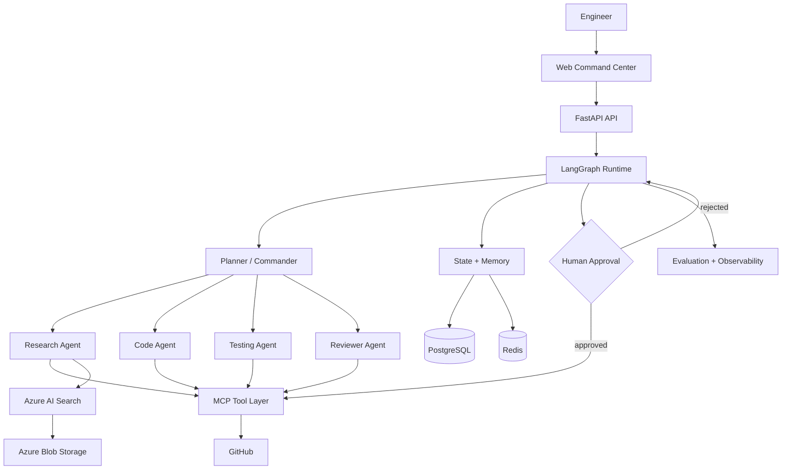

# AI Engineering Command Center

> An agentic AI platform that investigates real engineering problems, uses tools, proposes fixes, runs verification, and pauses for human approval before risky actions.

## Why this project exists

Most AI coding demos stop at code generation. The Command Center is designed around a harder problem:

**Give an AI engineer a real engineering task and let it investigate, reason, use tools, validate the result, and produce an evidence-backed outcome.**

Example:

> Analyze this repository and find why the `/search` endpoint is slow. Identify the root cause, propose a fix, run tests, and prepare the change for review.

## Architecture

### Interactive GitDiagram

Explore the repository architecture interactively in GitDiagram:

[Open AI Engineering Command Center in GitDiagram](https://gitdiagram.com/sii-1111/Ai-engineering-command-center)



## Core capabilities

- **Planner / Commander** — decomposes an engineering request into executable steps.
- **Specialized agents** — research, code, testing, and review roles.
- **MCP-first tooling** — tools are exposed through a consistent Model Context Protocol boundary.
- **Human-in-the-loop** — risky mutations require explicit approval.
- **Repository intelligence** — code search, file inspection, dependency analysis, and test execution.
- **Grounded investigation** — retrieval and evidence are carried into agent decisions.
- **Repository indexing pipeline** — Azure Blob text ingestion, deterministic chunking, Azure OpenAI embeddings, and Azure AI Search document upserts are separated behind testable provider boundaries.
- **Evaluation** — tool-call success, task completion, groundedness, latency, cost, recovery, and human intervention.
- **Observability** — capture task events, evaluation metrics, and engineering outcomes.
- **Asynchronous execution** — Redis-backed jobs are consumed by a dedicated worker process with durable task/job status transitions and failure recording.

## Current stack

| Layer | Technology |
|---|---|
| Frontend | Next.js / TypeScript |
| API | FastAPI / Python |
| Orchestration | LangGraph |
| Models | Azure OpenAI |
| Tool protocol | MCP |
| Retrieval | Azure AI Search |
| Object storage | Azure Blob Storage |
| State | PostgreSQL + Redis |
| Runtime | Docker |
| CI/CD | GitHub Actions |
| Evaluation | RAGAS + custom agent evals |
| Observability | OpenTelemetry + LangSmith |

## Repository structure

```text
.
├── apps/
├── agents/
├── core/
│   ├── evaluation/          # Agent/task evaluation
│   ├── memory/              # Working and persistent memory
│   ├── retrieval/           # Blob ingestion, chunking, embeddings, indexing
│   ├── security/            # Approval and tool policies
│   └── state/               # LangGraph state
├── tooling/
├── tests/
├── docs/
└── .github/workflows/
```

## Engineering principles

1. **Read before write.**
2. **Evidence before conclusion.**
3. **Least-privilege tools.**
4. **Human approval for consequential mutations.**
5. **Every important claim should be traceable to evidence.**
6. **Measure agent behavior instead of assuming it works.**
7. **Design for failure, recovery, and observability.**

## Roadmap

### Phase 1 — Engineering investigation
- [x] LangGraph state graph
- [x] GitHub MCP tools
- [x] Repository/code investigation
- [x] Test/check verification
- [x] Evidence-backed investigation report

### Phase 2 — Agentic orchestration
- [x] Planner
- [x] Research / investigation agent
- [x] Code modification flow
- [x] Verification flow
- [x] Reviewer / Critic Agent
- [x] Interrupt/resume HITL flow

### Phase 3 — Knowledge + memory
- [x] PostgreSQL-backed LangGraph checkpoint foundation
- [x] Optional Redis task snapshot store and health signal
- [x] Azure Blob ingestion adapter
- [x] Repository retrieval abstraction
- [x] Azure AI Search hybrid retrieval
- [x] Deterministic repository chunking foundation
- [x] Embedding + indexing adapter foundation
- [x] Working memory
- [x] Long-term engineering knowledge
- [x] Repository-aware RAG

### Phase 4 — Production engineering
- [x] Evaluation framework
- [x] Task observability events
- [x] Cost/latency metrics API
- [x] Durable task metadata and Redis job state
- [x] Dockerized services
- [x] CI/CD validation
- [ ] Enterprise authentication and RBAC
- [x] Production async task worker
- [ ] Azure deployment

## Project status

**Active development — production-style AI engineering platform.**

The current repository knowledge layer has provider boundaries for Blob ingestion, chunking, embeddings, and Azure AI Search indexing. The next step is wiring these primitives into the LangGraph research path so investigations can use repository-aware RAG with explicit evidence and retrieval metadata.
